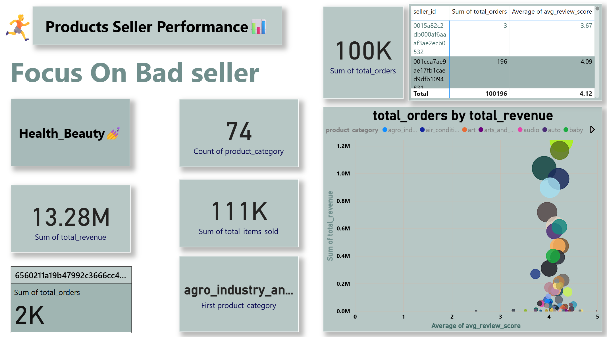
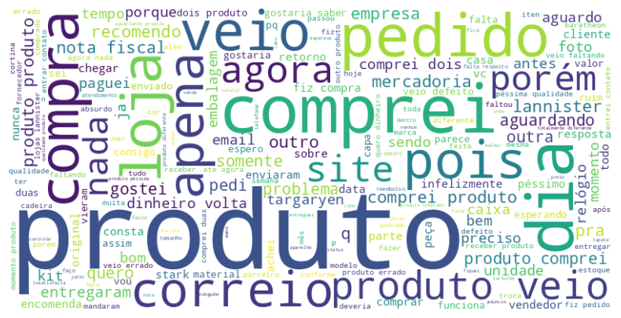
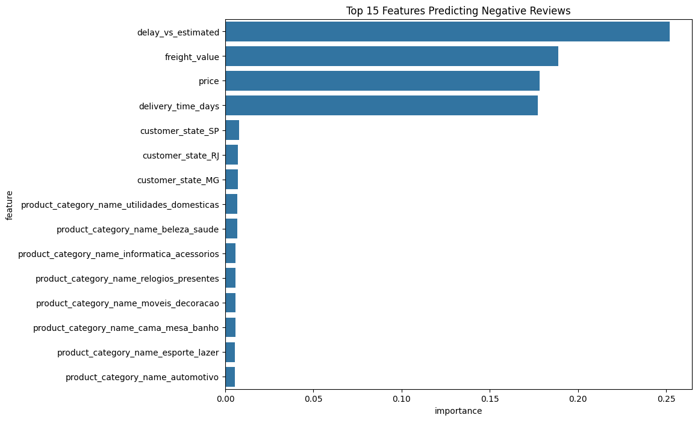

# Olist-ECommerce-Analysis
"End-to-end analysis of Olist E-Commerce dataset. Identified key drivers of customer churn and provided data-driven recommendations."

# Olist E-Commerce Analysis: A Deep Dive into Customer Churn & Product Strategy

---

### 1. Executive Summary: The "Most Valuable Customer" Crisis

This project began as an analysis of the Olist E-Commerce dataset (95,000+ orders) to diagnose a massive **94% customer churn rate** (one-time buyers).

Initial analysis (RFM & Power BI) pointed to **slow delivery times** as the primary cause of bad reviews. However, this was only a "symptom" of a much deeper problem.

A **Random Forest Machine Learning model** was built to predict 1-star reviews, and its "Feature Importance" analysis revealed the *real* diagnosis: the strongest predictors of a 1-star review are not just delays, but a toxic combination of:

1.  **`delay_vs_estimated` (Breaking the Delivery Promise)**
2.  **`freight_value` (High Shipping Cost)**
3.  **`price` (High Product Price)**

**The core insight is that Olist is not just losing *customers*; it is losing its *most valuable customers*.** We are failing our highest-paying clients (who buy expensive items and pay for expensive shipping) in our most important markets (São Paulo & Rio). This project shifted from a simple operational analysis to a high-urgency strategic recommendation to protect the company's most valuable revenue source.

---

### 2. Key Business Questions

1.  **Customer Behavior:** Who are our customers and why are they leaving? (RFM)
2.  **Product:** Which product categories are our "Stars" 🌟, "Problems" 🤔, "Opportunities" 🚀, and "Dogs" 🐶?
3.  **Root Cause (NLP):** When customers complain (besides delivery), what are they *actually* complaining about?
4.  **Prediction (ML):** Can we predict *which* orders will fail, and what are the *true* drivers of customer churn?

---

### 3. Tools & Tech Stack

* **Data Storage & Retrieval:** SQL (PostgreSQL)
* **Data Visualization & Dashboarding:** Power BI (including DAX for RFM)
* **Text Analysis (NLP) & Machine Learning:** Python (Pandas, NLTK, Scikit-learn, Matplotlib/Seaborn)
* **IDE:** Google Colab / Jupyter Notebook

---

### 4. The Analysis & Insights (The Data Story in 4 Acts)

#### Act 1: The "Leaky Bucket" (RFM & Logistics)

* **Insight:** We have a "leaky bucket." **94% of our 95k customers are "One-Time Buyers"**. An RFM analysis classified 83K customers as "At Risk."
* **Symptom:** A strong negative correlation was found between `delivery_time` and `review_score`. This was the initial clue.

#### Act 2: The "Red Herring" (Product Portfolio Matrix)

* **Insight:** We plotted all categories by Revenue vs. Avg. Review Score. Our initial hypothesis that high-revenue categories (`bed_bath_table`) were the problem was **wrong**. They were "Stars".
* **The Symptom Worsens:** We found the true "Problem Child" (`office_furniture`), which had high demand ($270K) but a disastrous 3.72 score. This was a clear sign of a deeper issue.

#### Act 3: The "Voice of the Customer" (NLP Root Cause)

* **Goal:** To understand *why* `office_furniture` was failing.
* **Process:** We ran NLP Topic Modeling on 1-star reviews (after filtering out delivery words).
* **Insight:** The root cause was a fulfillment crisis: **1. Damaged/Broken Item**, **2. Wrong Item Sent**, **3. Poor Quality**. This showed that customers were paying high prices for bad products.

#### Act 4: The "True Diagnosis" (Machine Learning)

* **Goal:** To build a model to predict negative reviews and find the true drivers.
* **Model:** RandomForestClassifier.
* **The Diagnosis:** The `Feature Importance` plot was the final proof. It confirmed that the most anger comes from customers who **pay high prices (`price`)** and **high shipping (`freight_value`)**, only to have their **promise broken (`delay_vs_estimated`)**. The `office_furniture` category was just the most obvious example of this toxic mix.

---

### 5. Strategic Recommendations (The New Action Plan)

The ML model's insight changes our entire strategy. The priority is no longer just "fixing operations"; it's "protecting our VIPs".

1.  **[Priority 1 - Operations] Launch "VIP Customer Protection Program":**
    * **Action:** Flag all orders where `price > X` and `freight_value > Y` (especially in `SP` or `RJ`). These orders get top priority for fulfillment and shipping monitoring. **We cannot fail these customers.**

2.  **[Priority 2 - Commercial] Freight Policy Review:**
    * **Action:** Review shipping prices for products known to have delays (like `office_furniture`). Charging high freight for a high-risk item is the "toxic mix" we must avoid.

3.  **[Priority 3 - Commercial] Surgical Strike & Cleanup:**
    * **Action (Fix):** Implement the `office_furniture` audit based on NLP findings (packaging, quality).
    * **Action (Clean):** Delist the `security_and_services` ("Dog") category.

4.  **[Priority 4 - Marketing] Smart Re-activation:**
    * **Action:** Segment the "At Risk" campaign. The "VIP" customers who left need a different, more personal apology and incentive than the low-value customers.

---

### Project Structure

2_RFM_Customer_Segmentation.sql │ ├── 3_Product_Portfolio_Analysis.sql │ └── 4_NLP_Data_Export.sql │ ├── Notebooks/ │ ├── Olist_NLP_Topic_Modeling.ipynb │ └── Review_Score_Prediction.ipynb │ ├── PowerBI_Visuals/ │ ├── Customersegmentations.png │ ├── Deliveryperformance.png │ ├── Month Growth.png │ ├── Products&sellers.png │ ├── NLP_WordCloud.png │ └── Feature_Importance.png │ └── README.md

---

### Contact

Mohamed Shauky

* [LinkedIn](https://www.linkedin.com/in/mohamed-shauky-7208a0303/)
* [Portfolio](https://mohamedshauky.my.canva.site/)
